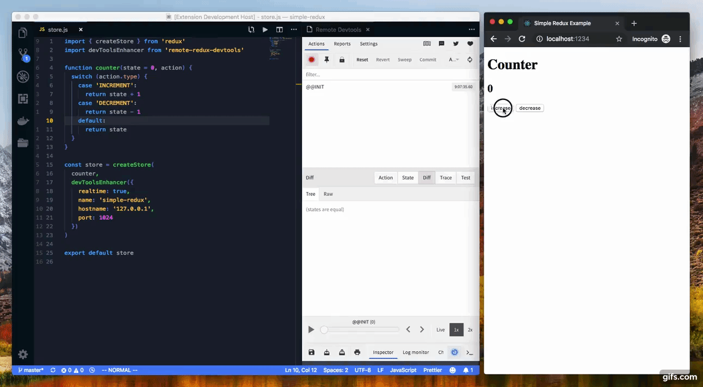

# Redux DevTools for VSCode

Visual Studio Code extension to integrate Redux Devtools into editor.

## Features

Inspect redux store of your app. Like the one you may use in Chrome.



## Quick Start

* Install the extension

* `CMD + Shift + P` to open **Command Palette** and type in `Redux Devtools`, select command `Open Devtool to the Side`.

* In devtool pannel, click settings to set listening port and host to your remotedev server.

* Optional, if you don't have an remotedev server running, you need to start one. (Find documentation [here](https://github.com/reduxjs/redux-devtools/tree/master/packages/redux-devtools-cli) or see our [example](/example/simple-redux))

* Additionally, you also need to compose remote redux devtool middleware into your redux store:

  ```javascript
  import { createStore, applyMiddleware } from 'redux'
  import { composeWithDevTools } from 'remote-redux-devtools'

  const composeEnhancers = composeWithDevTools({
    realtime: true,
    name: 'Your Instance Name',
    hostname: 'localhost',
    port: 1024 // the port your remotedev server is running at
  })

  const store = createStore(
    yourReducer,
    composeEnhancers(
      applyMiddleware(/* put your middlewares here */)
    )
  )
  ```

  ​

## Extension Settings

Redux Devtools contributes the following settings:

> Note that these settings are used when launching the devtool.
> You can also set those configurations manually by click `settings` in the top of the devtool. (after it is launched)

* `reduxdev.hostname`: The hostname your remotedev server started on.
* `reduxdev.port`: The socket port for Redux Devtools to listen.

## Known Issues

* redux-devtools-core can not persist settings inside vscode webview

## License
MIT

*powered by redux-devtools.*
